# ASIX1_M4_UF1_A3_Apuntes
Apuntes del curso

### Crear Respositorio
##### Para crear un repositorio clicamos el siguiente botón:
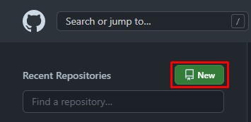
##### Seleccionamos los ajustes como el nombre, el estado, privado o publico, si queremos archivo README y de más. Una vez acabemos creamos el repositorio con el boton verde.
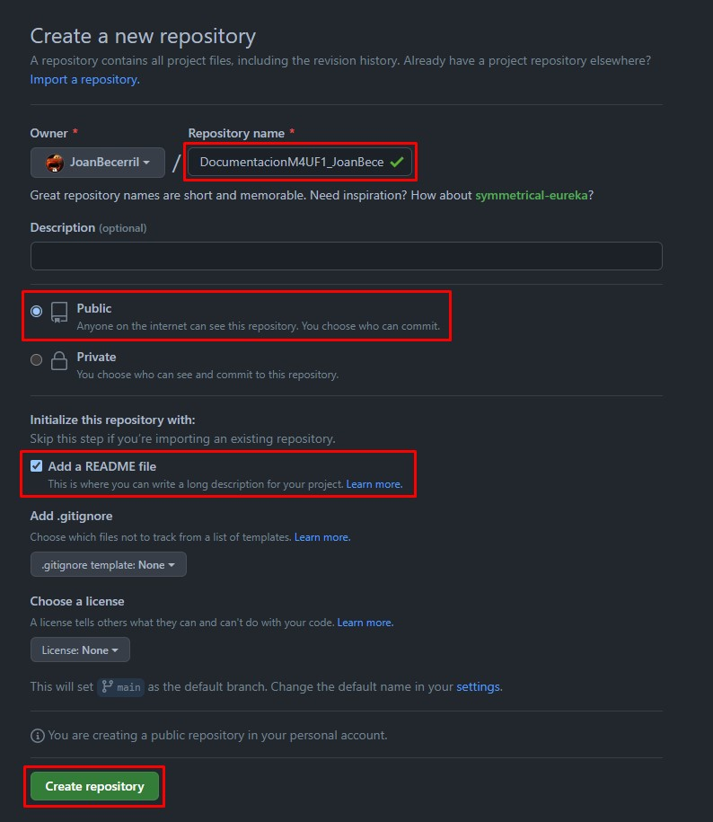
##### El repositorio ya estaria listo para usarse.

### Github Pages
##### Para conseguir el link de nuestra pagina web debemos ir a ajustes, en el apartado de 'Pages' veremos un seleccionador con 'None', ahí debemos cambiarlo por 'main'.
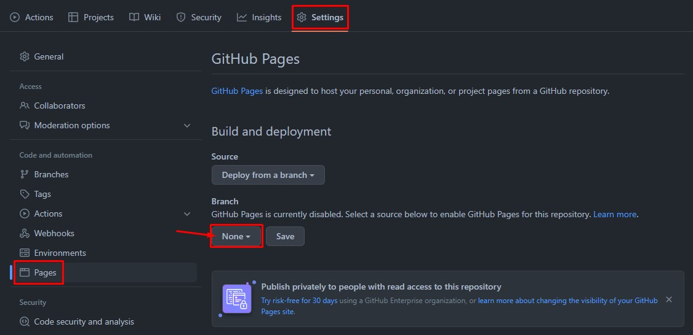
##### Una vez cambiado por 'main' guardaremos los cambios y nos aparecerá un link arriba. Este es el link de nuestra web de github.
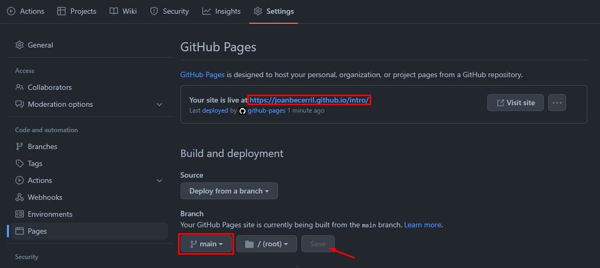
##### Para acabar vamos al principio de la pagina en github y vamos a este botón.
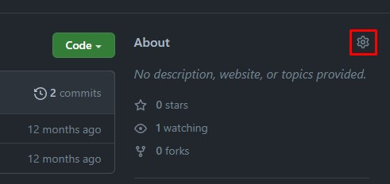
##### Con el link copiado lo pegamos en ese recuadro y guardamos. Esto es para que el link aparezca en la pagina principal y sea mas intuitivo.
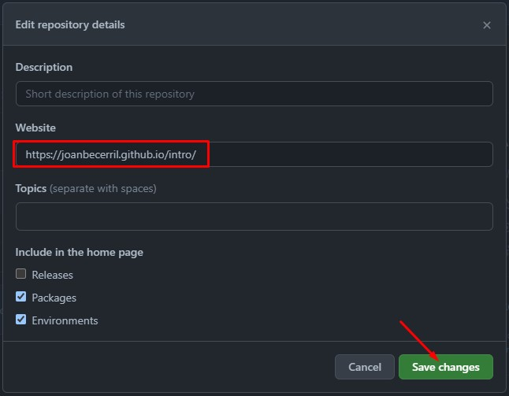

### Clonar Repositorio en VisualStudio
##### Para clonar el repositorio debemos copiar el codigo HTTPS como se muetra en la imagen.
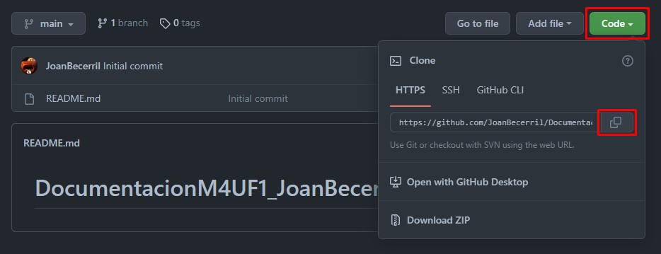
##### Abrimos VisualStudioCode y clicamos el boton de 'Clonar el repositorio Git' despues pegamos lo copiado anteriormente.
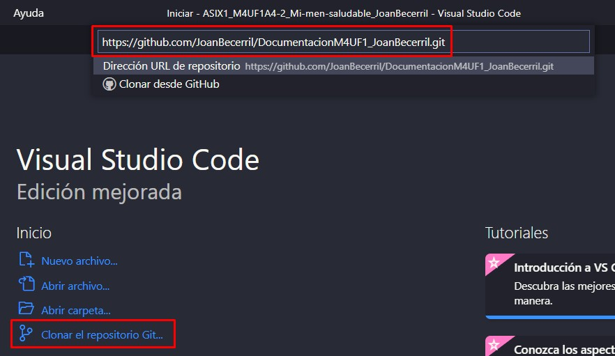
##### Como vemos ya estaria clonado en local y podriamos trabajar comodamente.
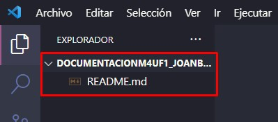

### Subir Cambios a Github
##### Para esto solamente necesitamos abrir una terminal en VisualStudioCode tal que asi:
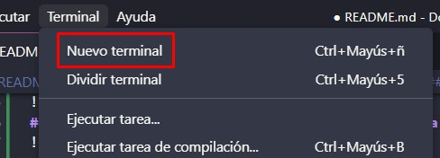
##### Y cuando se abra escribir estos 3 comandos:
###### git add .
###### git commit -m "subida"
###### git push
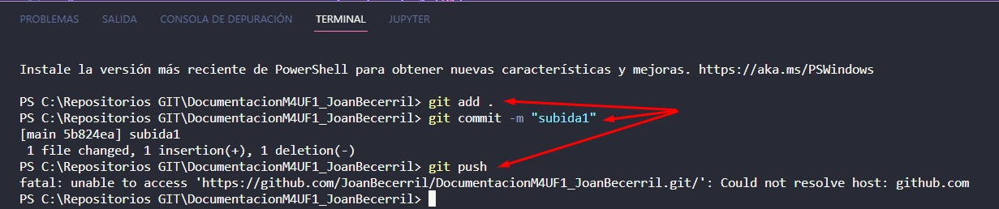

# Markdown
### Encabezados
Se utilizan de titulo, en los cuales hay diferentes tamaños:
```
#                                   Encabezado 1 [H1]
##                                  Encabezado 2 [H2]
###                                 Encabezado 3 [H3]
####                                Encabezado 4 [H4]
#####                               Encabezado 5 [H5]
######                              Encabezado 6 [H6]
```
#                                   Encabezado 1 [H1]
##                                  Encabezado 2 [H2]
###                                 Encabezado 3 [H3]
####                                Encabezado 4 [H4]
#####                               Encabezado 5 [H5]
######                              Encabezado 6 [H6]

### Estilos de letra
Para definir un estilo a un texto tenemos todos estos tipos:
```
***Estilo***                        Negrita y Cursiva
**Estilo**                          Negrita
*Estilo*                            Cursiva
**Estilo_Estilo_Estilo**            Negrita Cursiva Negrita
>Estilo                             Anotacion
~~Estilo~~                          Tachar
```
***Estilo***                        Negrita y Cursiva
**Estilo**                          Negrita
*Estilo*                            Cursiva
**Estilo_Estilo_Estilo**            Negrita Cursiva Negrita
>Estilo                             Anotacion
~~Estilo~~                          Tachar

### Codigo
El codigo se expresa con 3 comas y se interpreta asi:
```
<html>
  <div
  </div>
</html>
```
<html>
  <div>
  </div>
</html>

[Esto es un enlace](https://joan23.fje.edu "Enlace a la web del cole")

[Esto es una imagen del cielo](https://github.com/Marioto33/ASIX1-M4-UF1-A3-Apuntes/blob/main/img/cielo.jpeg "imagen del cielo azul")
### Listas
#### Desordenadas
```
- lista                             Elemento de lista
- lista                             Elemento de lista
  - lista                           Elemento de lista con 1 TAB
  - lista                           Elemento de lista con 1 TAB
    - lista                         Elemento de lista con 2 TAB
    - lista                         Elemento de lista con 2 TAB
```
- lista                             Elemento de lista
- lista                             Elemento de lista
  - lista                           Elemento de lista con 1 TAB
  - lista                           Elemento de lista con 1 TAB
    - lista                         Elemento de lista con 2 TAB
    - lista                         Elemento de lista con 2 TAB
#### Ordenadas
```
1. lista                            Elemento de lista 1
2. lista                            Elemento de lista 2
3. lista                            Elemento de lista 3
4. lista                            Elemento de lista 4
  1. lista                          Elemento de lista 5 con TAB
  2. lista                          Elemento de lista 6 con TAB
```
1. lista                            Elemento de lista 1
2. lista                            Elemento de lista 2
3. lista                            Elemento de lista 3
4. lista                            Elemento de lista 4
  1. lista                          Elemento de lista 5 con TAB
  2. lista                          Elemento de lista 6 con TAB

### LINKS
```
<https://drive.google.com/>
```
<https://drive.google.com/>

## IMAGENES
```

```


# HTML

### ANATOMIA HTML
```
<!DOCTYPE html>					Tipo de documento (html)
<html>						Código html (necesario)
<body>						Cuerpo
<head>						Estructura html
<title>						Titulo (Titulo pestaña Google)
<h1> <h2> <h3> <h4> <h5> <h6>		Encabezado
<div>							División
<p>							Espacio en blanco
<a>							Hipervínculo (href=” “)
<br>							Espacio en blanco (enter)
<ul>							Comienzo de lista (•)
	<li>						Elemento de lista (•)
<ol>							Comienzo de lista (numerada)
	<li>						Elemento de lista (numerada)
<link>						Insertar link 
							Insertar una foto
<video>						Insertar un video
<tbody>						Cuerpo de tabla
<thead>						Cabeza de tabla
<table>						Crear tabla
	<thread>					Agrupar contenido en tabla
		<tr>					Fila de la tabla
			<th>				Texto en fila
<foot>						Pie de tabla
<form>						Recopilar información
<input>						Entrada de texto
<label>						Muestra texto escrito
<article>						Contiene artículos, blogs…
<section>						Define elementos en un doc
<aside>						Contiene info principal
<figure>						Encapsular un medio
<audio>						Insertar audio
```

# CSS

### SELECTOR  {  }
```
. {
body {							Cuerpo
h1 h2 h3 h4 h5 h6 {					
p {							Selector
```

### PROPIEDADES   :  ;
```
font-family:						Tipo de fuente
font-size:						Tamaño de fuente
font-weight:						Grosor de fuente
text-align:						Alinear texto
color: 							Color de fuente
opacity:						Opacidad
background:						Fondo
background-color:					Color de fondo
background-image:					Imagen de fondo
heading-background					
border: -radius:					Borde
position:						Posición
width:							Ancho
height:							Alto
padding: -top, -right, -bottom, -left:			Relleno
margin: -top, -right, -bottom, -left:			Margen
text: -decoration					Texto
min:							Mínimo
max:							Máximo
overflow:							
hidden:							
visible:							
collapse:							
box: -sizing:						
display:							
float:							
right:							Derecha
left:							Izquierda
center:							Centro
justify:						Justificado
```

VALORES ;
```
url							URL
0px							Pixeles
auto							Automático
center							Centro
scroll							
hidden							
border-box							
static							
relative							
absolute							
fixed								
sticky							
block								
inline-block						
blue (colores en general)				Colores
```
